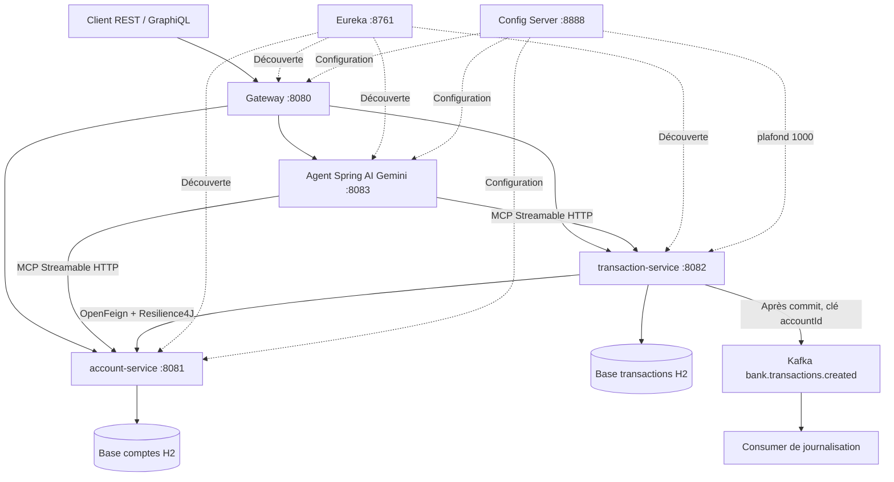
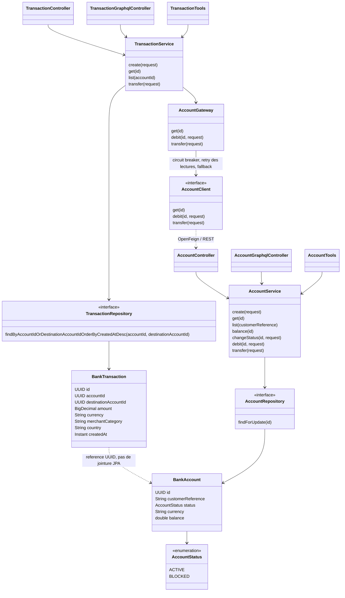

# Conception de la plateforme

## Architecture

```mermaid
flowchart TB
    REST[Client REST / GraphiQL] --> GW[Gateway :8080]
    GW --> A[account-service :8081]
    GW --> T[transaction-service :8082]
    GW --> AI[Agent Spring AI Gemini :8083]
    AI -->|MCP Streamable HTTP| A
    AI -->|MCP Streamable HTTP| T
    T -->|OpenFeign + Resilience4J| A
    A --> DA[(Base comptes H2)]
    T --> DT[(Base transactions H2)]
    T -->|Après commit, clé accountId| K[Kafka bank.transactions.created]
    K --> C[Consumer de journalisation]
    E[Eureka :8761] -. Découverte .-> GW
    E -. Découverte .-> A
    E -. Découverte .-> T
    E -. Découverte .-> AI
    CFG[Config Server :8888] -. Configuration .-> GW
    CFG -. Configuration .-> A
    CFG -. plafond 1000 .-> T
    CFG -. Configuration .-> AI
```

## Diagramme de classes

```mermaid
classDiagram
    class BankAccount {
        UUID id
        String customerReference
        AccountStatus status
        String currency
        double balance
    }
    class AccountStatus {
        <<enumeration>>
        ACTIVE
        BLOCKED
    }
    class BankTransaction {
        UUID id
        UUID accountId
        UUID destinationAccountId
        BigDecimal amount
        String currency
        String merchantCategory
        String country
        Instant createdAt
    }
    class AccountService {
        create(request)
        get(id)
        list(customerReference)
        balance(id)
        changeStatus(id, request)
        debit(id, request)
        transfer(request)
    }
    class TransactionService {
        create(request)
        get(id)
        list(accountId)
        transfer(request)
    }
    class AccountClient {
        <<interface>>
        get(id)
        debit(id, request)
        transfer(request)
    }
    class AccountGateway {
        get(id)
        debit(id, request)
        transfer(request)
    }
    class AccountRepository {
        <<interface>>
        findForUpdate(id)
    }
    class TransactionRepository {
        <<interface>>
        findByAccountIdOrDestinationAccountIdOrderByCreatedAtDesc(accountId, destinationAccountId)
    }
    class AccountController
    class TransactionController
    class AccountGraphqlController
    class TransactionGraphqlController
    class AccountTools
    class TransactionTools
    BankAccount --> AccountStatus
    BankTransaction ..> BankAccount : reference UUID, pas de jointure JPA
    AccountController --> AccountService
    AccountGraphqlController --> AccountService
    AccountTools --> AccountService
    AccountService --> AccountRepository
    AccountRepository --> BankAccount
    TransactionController --> TransactionService
    TransactionGraphqlController --> TransactionService
    TransactionTools --> TransactionService
    TransactionService --> TransactionRepository
    TransactionRepository --> BankTransaction
    TransactionService --> AccountGateway
    AccountGateway --> AccountClient : circuit breaker, retry des lectures, fallback
    AccountClient ..> AccountController : OpenFeign / REST
```
